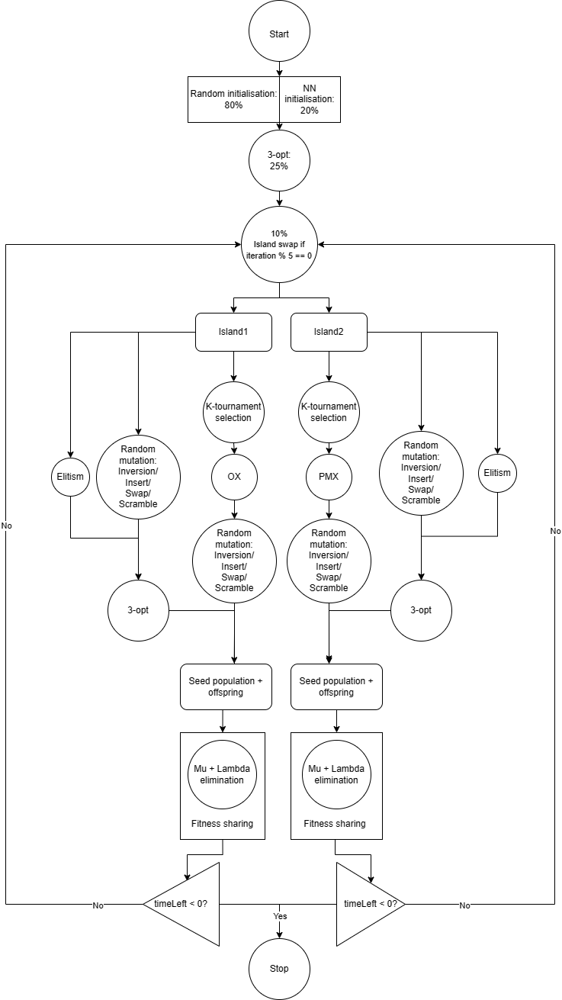
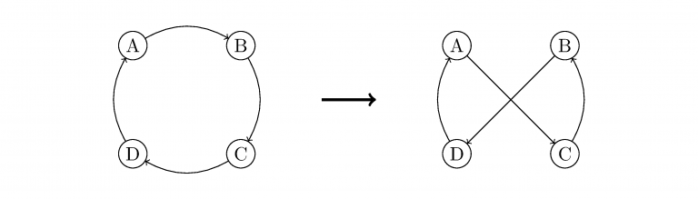
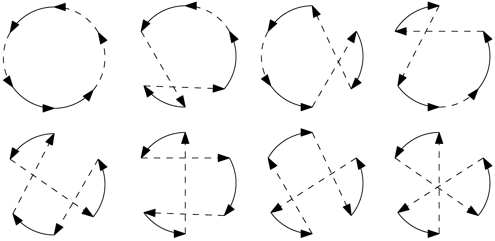
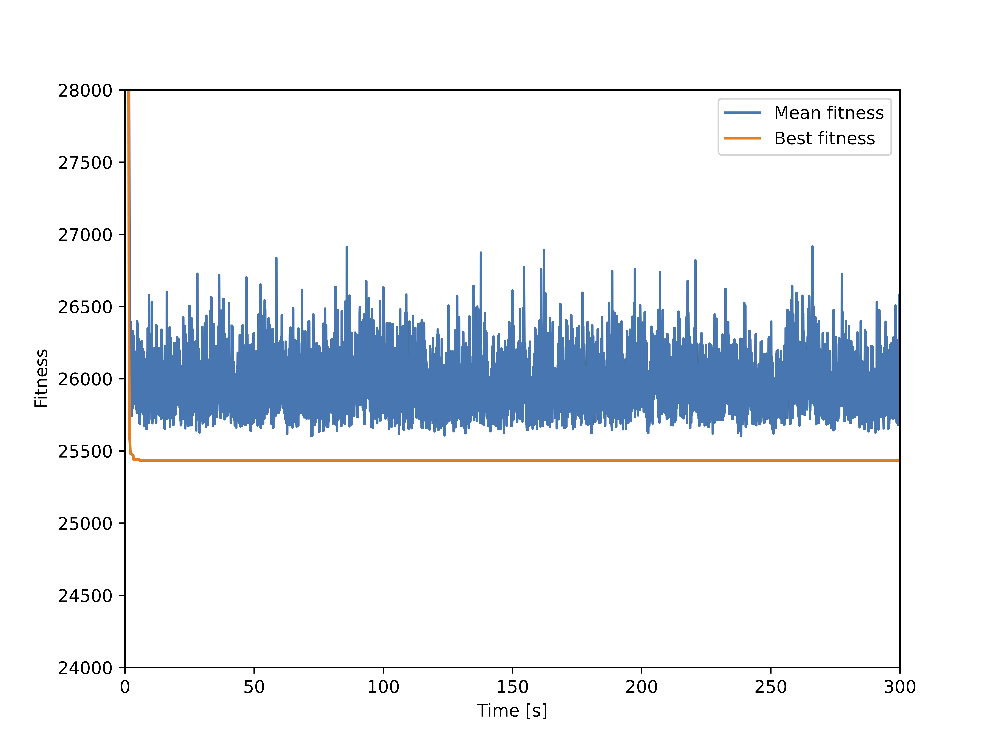
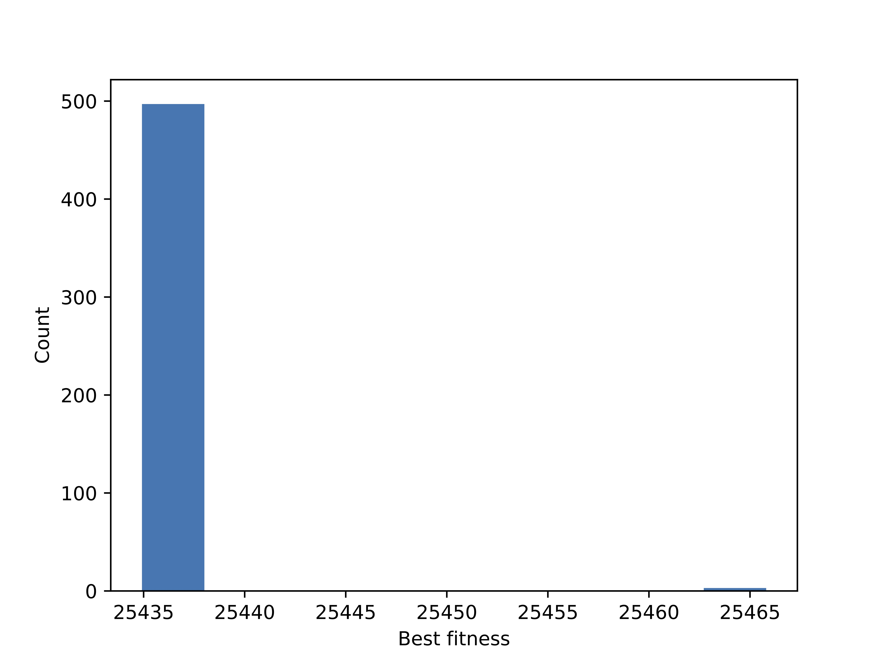
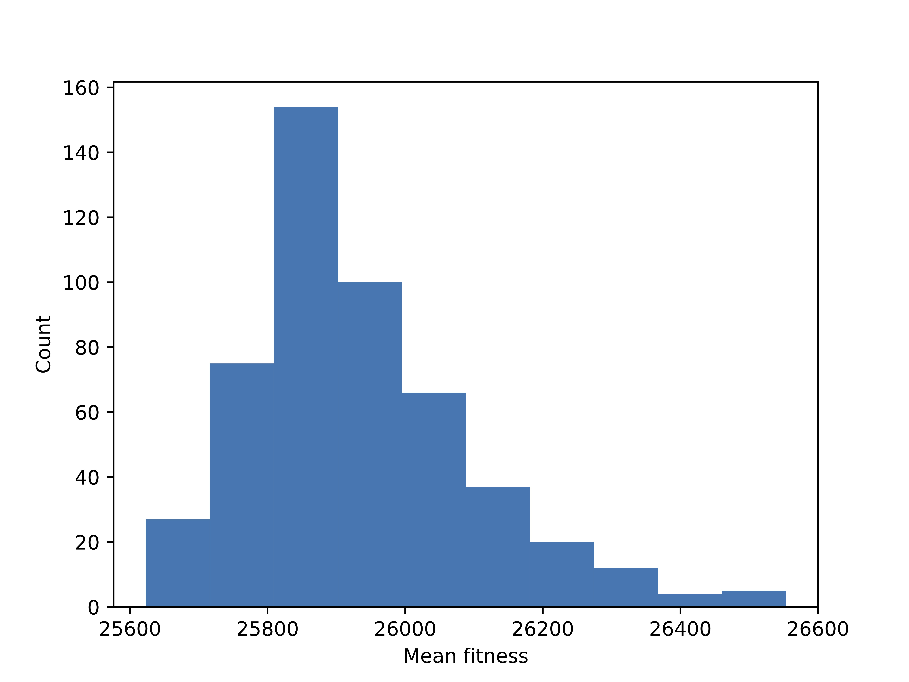
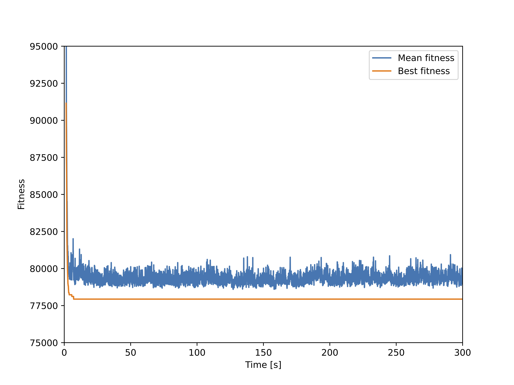
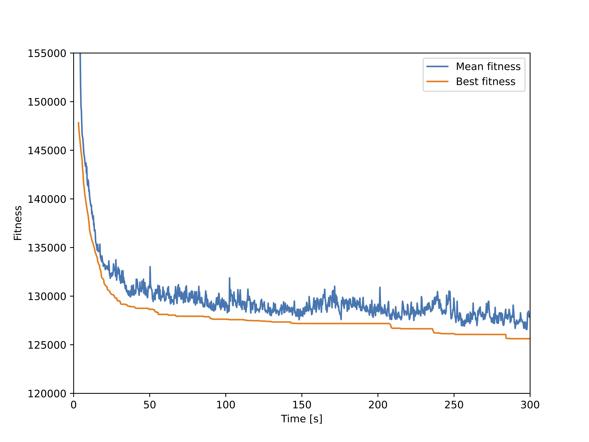

# Evolutionary Algorithms for the Asymmetric TSP (ATSP)

This repository contains a high-performance **Genetic Algorithm (GA)** for the **Asymmetric Traveling Salesman Problem (ATSP)**, optimized to produce strong solutions under a strict **5-minute runtime limit**.

The design is explicitly **hybrid**: a very strong **ATSP-aware 3-opt local search** is combined with **diversity preservation** (fitness sharing + island model) to maintain exploration while steadily improving solution quality.

---

## Highlights

- **ATSP-aware 3-opt** applied both during **initialization** and **variation**, with substantial optimizations + **Numba** to make it feasible.
- **Diversity promotion is mandatory** when using 3-opt at scale:
  - **Fitness sharing during elimination**
  - **Two-island model** using different crossover operators + periodic migration
- **Rich but diverse initialization**:
  - Random **valid** individuals using a backtracking generator
  - **Nearest Neighbour (NN)** seeding (randomized start + backtracking)
  - Local-search enrichment on a subset of the initial population
- Extensive operator exploration (PMX/OX/CX/CSOX, multiple mutations, multiple elimination schemes) with final configuration selected via empirical testing.

---

## Algorithm overview

  
   
  <em>Main evolutionary loop used in the final implementation</em>

**High-level flow**
- **Representation:** permutation of city indices
- **Initialization:** random-valid + NN seeding + partial 3-opt enrichment
- **Selection:** k-tournament
- **Variation:** crossover + mutation + 3-opt on seed population
- **Evaluation**
- **Elimination:** (μ + λ) with fitness sharing
- **Diversity:** 2-island model + migration

---

## Representation

A candidate solution is represented as a **permutation** of city indices (visit order).  
Each individual is an instance of an `Individual` class with:
- `permutation`: numpy array
- `fitness`: objective value (tour length; invalid edges handled as infinite)
- `alpha`: mutation rate (**self-adaptive**)
- `fitness_share`: temporary fitness value used during fitness sharing

This representation is compact and directly compatible with permutation-based crossover/mutation operators.

---

## Initialization

Goal: start with a population that is **diverse** but not dominated by invalid tours.

### 1) Random valid individuals via backtracking (main source of diversity)
Generating uniformly random permutations often yields **invalid tours** with infinite fitness.  
Instead, I generate **random but valid** tours using a randomized backtracking walk:
- start from a random city
- repeatedly choose a random unvisited adjacent city
- if stuck, backtrack and try an alternative

This improves early search quality while keeping high diversity.

### 2) Nearest Neighbour (NN) seeding (20%)
To bias the search toward good regions of the space without collapsing diversity:
- **20%** of the population is initialized using a randomized NN heuristic
- start city is random; backtracking is used when the greedy choice gets stuck

### 3) 3-opt enrichment during initialization (25%)
To further enrich the initial pool, the **3-opt local search** (Section below) is applied to **25%** of the total initial population.

**Final composition**
- 37.5% random valid
- 12.5% random valid + 3-opt
- 15% NN
- 5% NN + 3-opt

With code optimizations, initialization for the largest benchmark (tour1000) runs in **< 10 seconds**.

---

## Selection

**k-tournament selection** (sampling without replacement):
- higher `k` → higher selective pressure (more exploitation)
- lower `k` → more exploration

Final value used: `k_s = 3`.

---

## Mutation

Implemented mutation operators:
- **Insert**
- **Swap**
- **Inversion**
- **Scramble**

Because the problem is **asymmetric**, inversion breaks many directed edges (often behaving similarly to scramble). To increase diversity, the mutation operator is chosen **randomly** at each application.

### Elitism
To avoid degrading the best solution, **elitism** prevents the best `k_e = 1` seed individual from being mutated.

### Self-adaptive mutation rate
The mutation rate `alpha` is stored per individual and controlled through **self-adaptivity**, with a minimum value of **0.05**.

When crossover produces a child from parents `p1`, `p2`:

$$
\alpha_{child} = \max(\alpha_{p1} + \beta(\alpha_{p2} - \alpha_{p1}), 0.05)
$$

with $\beta \sim U[0.5, 1.5)$.

Self-adaptivity notably improved performance, especially in avoiding early stagnation.

---

## Recombination (crossover)

Implemented and tested:
- **PMX** (Partially Mapped Crossover)
- **OX** (Order Crossover)
- **CX** (Cycle Crossover)
- **CSOX** (Complete Subtour Order Crossover)

Although literature often recommends edge-based operators for TSP, experiments showed that **PMX** and **OX** performed best and most consistently on the ATSP instances used here.

### Final design: two islands with different crossovers
- **Island 1:** **OX**
- **Island 2:** **PMX**

**Motivation**
- ATSP is order-sensitive (A→B differs from B→A), so preserving relative order is valuable.
- OX tends to preserve order strongly; PMX provides complementary mixing behavior.
- Using them on separate islands helps maintain diversity while still exploiting good building blocks.

---

## Elimination

Explored elimination schemes:
- $(\mu + \lambda)$ elimination
- k-tournament elimination
- $(\mu, \lambda)$ elimination

Final choice: **$(\mu + \lambda)$ elimination**, which introduces strong selective pressure and yields fast progress—**but requires diversity control**.

---

## Diversity promotion

Because 3-opt + $(\mu+\lambda)$ creates strong exploitation pressure, diversity preservation is crucial.

### Fitness sharing during elimination
Fitness sharing reduces the chance that many near-duplicate individuals survive:
- similarity metric: **Hamming distance** between permutations
- sharing updated incrementally: only compute distances between the **newly promoted** survivor and remaining candidates
- accelerated with **Numba**

Tunable parameters:
- `sigma_f`: neighborhood radius (fraction of permutation length)
- `alpha_f`: sharing strength

Fitness sharing combined with $(\mu+\lambda)$ elimination produced the best and most stable results.

### Island model (2 islands)
Two subpopulations evolve independently with different crossovers:
- every `i_s = 5` iterations, swap `p_s = 10%` of individuals between islands (randomly selected)

Multithreading per island was implemented but did not speed up overall runtime due to overhead and scheduling bottlenecks.

---

## Local search (2-opt vs 3-opt for ATSP)

Tested:
- Nearest Neighbour (heuristic / init)
- 2-opt
- 3-opt

For **ATSP**, 2-opt often reverses segments, breaking many directed edges. It also requires expensive delta computation because many edges are affected.

  
   
  <em>2-opt swap can reverse a large segment, which is problematic in ATSP</em>

### ATSP-aware 3-opt variant
3-opt considers three-edge swaps with seven reconnection patterns.  
Most reconnections still reverse segments (problematic for ATSP), but one reconnection preserves visit order and behaves as a true local improvement step for ATSP.

  
   
  <em>Order-preserving 3-opt reconnection used in this project</em>

### Making 3-opt feasible (key engineering work)
3-opt is powerful but expensive due to the number of edge triples. I made it feasible through:
- **early break** when a candidate new edge is invalid (infinite length)
- **early break** when partial delta cannot beat the best delta found so far
- pruning cases where an old edge is infinite (cannot be improved upon)
- **Numba acceleration** for performance-critical loops

Final usage:
- 3-opt is applied to the **entire seed population after mutation** during variation
- elitism-protected best individual is reintroduced before 3-opt so it can also be improved
- applying 3-opt to offspring was tested but caused faster stagnation (offspring dominance)

---

## Parameter selection

With extensive code optimization, population/offspring sizes were not the bottleneck.  
Values tested: `λ, μ ∈ {50, 100}`. No configuration consistently dominated across instances, so the final choice is:

- `λ = 50` (population size)
- `μ = 100` (offspring size)

Other parameters were determined via a hyperparameter search, mainly tuned on larger instances under the 5-minute budget.

---

## Experimental setup

**Environment**
- Python 3.10.12
- Intel Core i7-1165G7 @ 2.8 GHz
- 4 physical cores (8 logical)
- 16 GB RAM

**Final parameters**
- `λ = 50`: population size
- `μ = 100`: offspring size
- `p_l = 1`: fraction of seed population receiving 3-opt during variation
- `p_i = 0.25`: fraction receiving 3-opt during initialization
- `p_k = 0.2`: NN initialization fraction
- `p_s = 0.1`: migration fraction between islands
- `i_s = 5`: migration interval
- `k_s = 3`: k-tournament selection size
- `k_e = 1`: elitism count
- `alpha_f = 1`: fitness sharing strength
- `sigma_f = 1`: neighborhood radius (fraction of permutation length)

---

## Results (benchmarks)

### tour50
Best found: **25434.9184**  
Converges almost instantly; best solution is extremely consistent across runs.

  

  
  

### tour100
Best found: **77936.8304**  
Fast convergence; mean remains higher than best, indicating maintained diversity.

  

### tour500
Best found: **125624.6402**  
Still improving at 5 minutes → not fully converged, but trend suggests near-optimal.

  

### tour1000
Best found: **152187.5324**  
Best fitness continues improving; mean stays above best, showing diversity.

  

---

## Critical reflection

### Strengths of evolutionary algorithms
- Broadly applicable (useful when near-optimal solutions are sufficient)
- Highly customizable and easy to hybridize (heuristics + local search + diversity mechanisms)
- Strong literature and reusable operator patterns

### Weaknesses
- Hyperparameter tuning is expensive and problem-dependent
- Often dominated by specialized algorithms on specific problem families
- Computationally expensive due to large numbers of evaluations

---

## References

- A.E. Eiben, J.E. Smith. *Introduction to Evolutionary Computing*, 2nd ed., 2015.
- Thanan Toathom, Paskorn Champrasert. *The Complete Subtour Order Crossover in Genetic Algorithms for Traveling Salesman Problem Solving*, 2022.
- Gerard Sierksma. *Hamiltonicity and the 3-opt procedure for the Traveling Salesman Problem*, 2022.
- Goran Martinovic, Drazen Bajer. *Impact of NNA implementation on GA performance for the TSP*, 2022.
